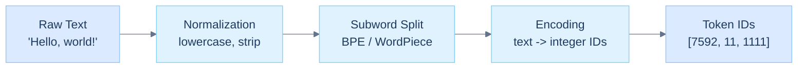
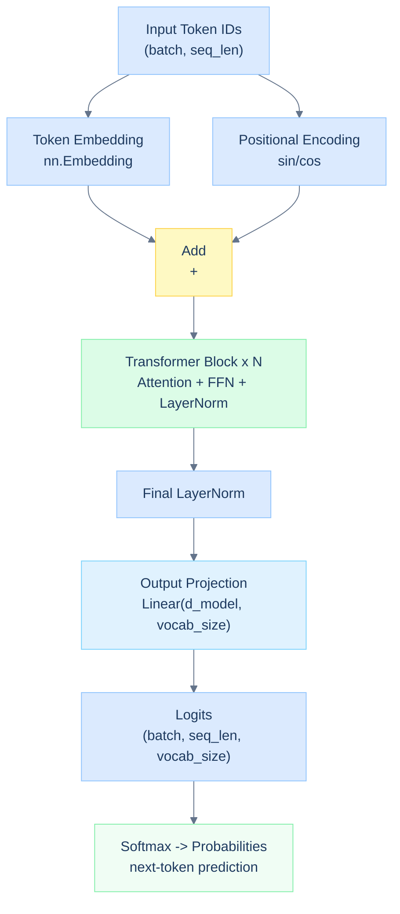

# Day 1: Setup + Peek Inside

## Overview

This session covers the foundational building blocks of large language models: tokenization, embeddings, and the forward pass. By the end you will understand how raw text is transformed into vectors and how those vectors flow through a neural network to produce predictions.

---

## Learning Objectives

- Set up the Kaggle GPU environment and verify CUDA and PyTorch
- Understand tokenization and how text maps to integers
- Understand embedding spaces and why they capture semantic meaning
- Trace a complete forward pass from input tokens to output logits
- See how the full pipeline composes into next-token prediction

---

## Prerequisites

- Python 3.10+
- Basic understanding of neural networks (forward pass, backprop)
- Familiarity with PyTorch tensors
- Comfort with NumPy and basic linear algebra

Assumed knowledge: matrix multiplication, what an embedding is conceptually, basic attention intuition.

---

## Part 1: Kaggle GPU Setup

### Environment Verification

```python
import torch

print(f"PyTorch Version: {torch.__version__}")
print(f"CUDA Available: {torch.cuda.is_available()}")
print(f"GPU Device: {torch.cuda.get_device_name(0) if torch.cuda.is_available() else 'CPU'}")
```

Expected output on Kaggle GPU:

```
PyTorch Version: 2.1.0+cu121
CUDA Available: True
GPU Device: Tesla P100
```

### Mixed Precision Setup

```python
from torch.cuda.amp import autocast, GradScaler

device = torch.device('cuda' if torch.cuda.is_available() else 'cpu')
scaler = GradScaler()
```

Mixed precision (FP16/BF16) reduces memory usage by roughly 50% with negligible accuracy loss during inference.

---

## Part 2: Tokenization

### What Is Tokenization?

Tokenization converts raw text into a sequence of discrete integer IDs that a model can process. The pipeline has three stages:



### Why Subword Tokenization?

Character-level tokenization produces a vocabulary that is too large for Unicode and makes sequences very long. Word-level tokenization fails on rare or unseen words (out-of-vocabulary). Subword tokenization - used by BPE, WordPiece, and SentencePiece - balances vocabulary size against coverage.

BPE works by iteratively merging the most frequent adjacent byte pairs in the training corpus until a target vocabulary size is reached. The result is a vocabulary of common word fragments that can represent any text without OOV tokens.

### Tokenizers in Practice

```python
from transformers import AutoTokenizer

tokenizer = AutoTokenizer.from_pretrained('gpt2')

text = "Hello, how are you?"
tokens = tokenizer.encode(text)
print(tokens)
# [15496, 11, 703, 389, 345, 30]

token_strings = tokenizer.convert_ids_to_tokens(tokens)
print(token_strings)
# ['Hello', ',', ' how', ' are', ' you', '?']
```

### Special Tokens

Every tokenizer reserves a set of special tokens for structural purposes:

| Token | Purpose |
|-------|---------|
| `<bos>` | Beginning of sequence |
| `<eos>` | End of sequence |
| `<pad>` | Padding to uniform batch length |
| `<unk>` | Fallback for truly unknown characters |

---

## Part 3: Embeddings

### What Is an Embedding?

An embedding is a learned mapping from discrete token IDs (integers) to continuous vectors in a high-dimensional space.

```
Token ID 42  ->  embedding lookup  ->  [0.2, -0.5, 0.8, ..., 0.1]
                                        ^
                                        768-dimensional vector
```

Before embeddings, tokens are just numbers with no geometric relationship. After embeddings, semantically related tokens occupy nearby regions of the vector space - enabling the arithmetic relationships made famous by Word2Vec:

```python
# After training, the embedding space captures semantic relationships
embedding['king'] - embedding['man'] + embedding['woman']  ~=  embedding['queen']
```

### Embedding Space Properties

- **Similarity** - semantically similar tokens have high cosine similarity
- **Algebraic structure** - vector offsets encode semantic shifts
- **Dimensionality** - typically 512 to 4096 dimensions; we use 768 today
- **Learnable** - embeddings are model parameters updated during training

### Creating Embeddings

```python
import torch
import torch.nn as nn

vocab_size = 50257   # GPT-2 vocab size
embedding_dim = 768  # Hidden size

embedding_layer = nn.Embedding(vocab_size, embedding_dim)

token_ids = torch.tensor([15496, 11, 703])   # "Hello, how"
embeddings = embedding_layer(token_ids)

print(embeddings.shape)   # (3, 768)
```

### Positional Encoding

Attention is permutation-invariant - the same output regardless of token order. Positional encoding injects order information by adding a position-dependent signal to each embedding:

```python
import math

def positional_encoding(seq_len, d_model):
    position = torch.arange(seq_len).unsqueeze(1)
    div_term = torch.exp(torch.arange(0, d_model, 2) * (-math.log(10000.0) / d_model))

    pe = torch.zeros(seq_len, d_model)
    pe[:, 0::2] = torch.sin(position * div_term)
    pe[:, 1::2] = torch.cos(position * div_term)

    return pe
```

The sine and cosine functions at different frequencies ensure each position gets a unique, smoothly-varying encoding that generalizes to sequence lengths not seen during training.

---

## Part 4: The Forward Pass

### Pipeline Overview



### Step 1: Input Processing

```python
input_ids = torch.tensor([[15496, 11, 703]])   # "Hello, how"
# shape: (batch_size=1, seq_len=3)

embeddings = embedding_layer(input_ids)
# shape: (1, 3, 768)
```

### Step 2: Self-Attention

The attention mechanism lets each token gather information from all other tokens in the sequence, weighted by relevance.

```python
def attention(Q, K, V):
    """Scaled dot-product attention: Softmax(Q K^T / sqrt(d_k)) V"""
    d_k = Q.shape[-1]

    scores = torch.matmul(Q, K.transpose(-2, -1)) / math.sqrt(d_k)
    # shape: (batch, seq_len, seq_len)

    weights = torch.softmax(scores, dim=-1)
    # each row sums to 1.0 - a probability distribution over positions

    output = torch.matmul(weights, V)
    # shape: (batch, seq_len, d_model)

    return output, weights
```

Q, K, and V are linear projections of the same input. The dot product Q K^T measures compatibility between every pair of positions, softmax normalizes to a distribution, and the weighted sum of V blends contextual information.

### Step 3: Feed-Forward Network

After attention, each position is passed independently through a two-layer MLP:

```python
def feed_forward(x, d_model=768, d_ff=3072):
    """Position-wise FFN: expand then contract"""
    x = nn.Linear(d_model, d_ff)(x)   # expand 4x
    x = torch.relu(x)
    x = nn.Linear(d_ff, d_model)(x)   # contract back
    return x
```

The 4x expansion ratio is a design choice inherited from the original transformer. Modern models use GELU instead of ReLU.

### Step 4: Output Logits

```python
# after N transformer blocks
logits = nn.Linear(768, vocab_size)(final_hidden_states)
# shape: (1, 3, 50257)
# each position predicts a distribution over the full vocabulary

probabilities = torch.softmax(logits, dim=-1)
next_token_id = torch.argmax(probabilities[0, -1, :])
print(f"Next token: {tokenizer.decode([next_token_id])}")
```

### The Complete Forward Pass

```python
def forward_pass(input_ids, model):
    x = model.embedding(input_ids)                        # token embeddings
    x = x + model.positional_encoding(input_ids.shape[1])  # add position

    for block in model.transformer_blocks:
        x = block.attention(x) + x    # attention with residual
        x = block.feed_forward(x) + x  # FFN with residual

    logits = model.output_projection(x)  # (batch, seq_len, vocab_size)
    return logits
```

The residual connections (`+ x`) are critical - they allow gradients to flow directly to early layers and make deep networks stable to train.

---

## Key Takeaways

- Tokenization maps variable-length text to fixed-size integer sequences without out-of-vocabulary failures.
- Embeddings give tokens geometric meaning - similarity in vector space reflects semantic similarity.
- Positional encoding tells the model where each token appears, since attention alone is order-agnostic.
- Self-attention lets every token attend to every other token, producing context-aware representations.
- The full pipeline is: tokens -> embeddings + positions -> N x (attention + FFN) -> logits -> probabilities.

---

## References

- [Attention Is All You Need](https://arxiv.org/abs/1706.03762) - Vaswani et al., 2017
- [HuggingFace Tokenizers Guide](https://huggingface.co/course/en/chapter2/1)
- [The Illustrated Transformer](http://jalammar.github.io/illustrated-transformer/)
