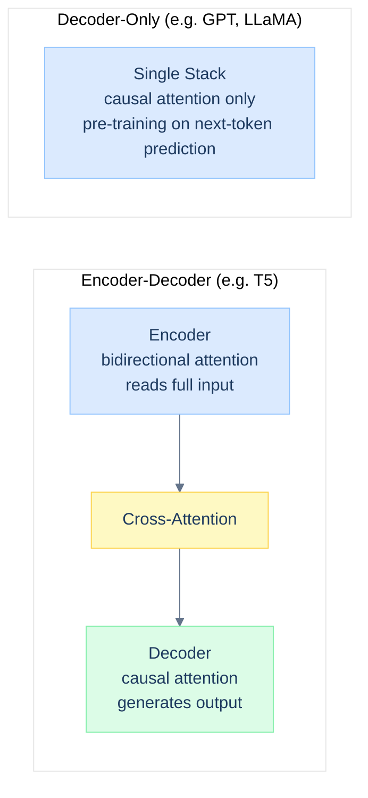
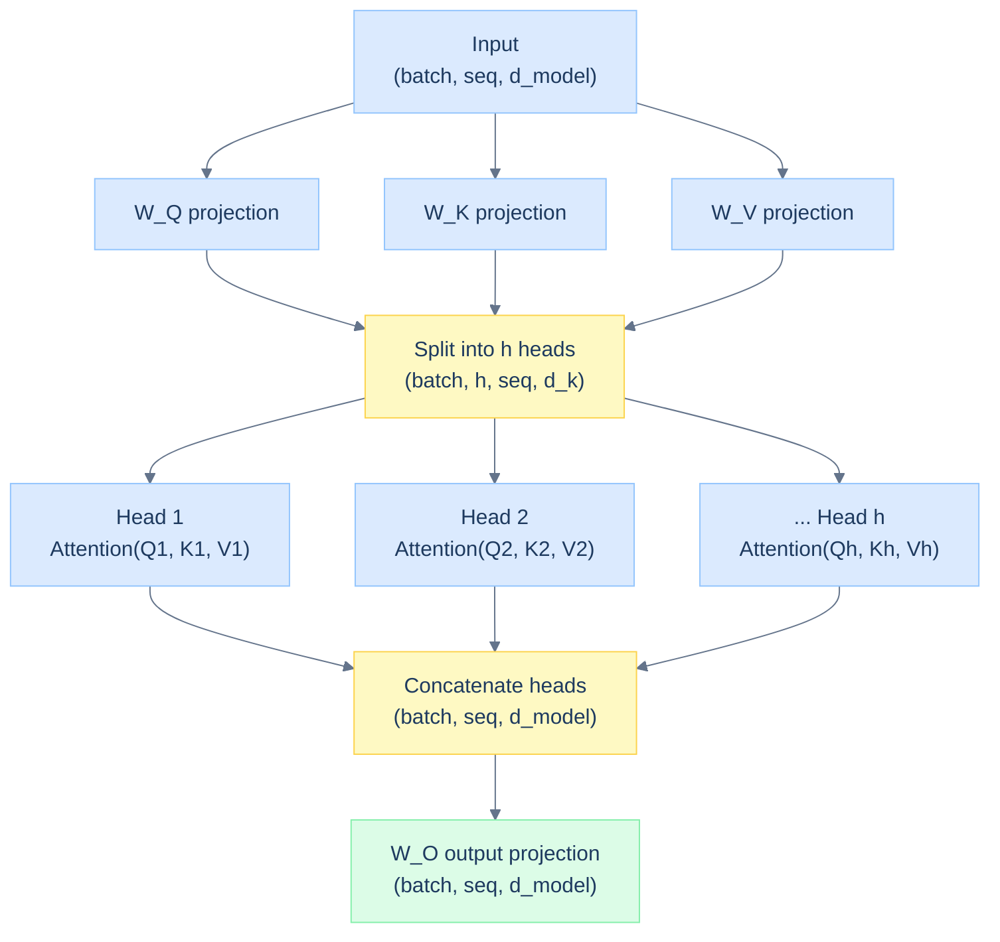
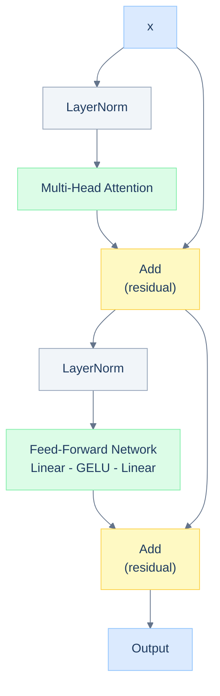
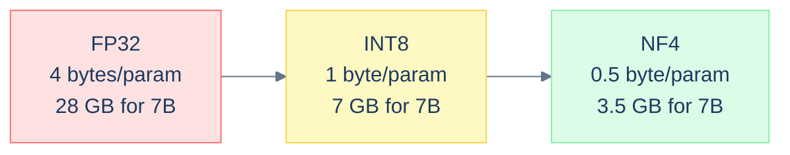

# Day 2: LLM Architecture

## Overview

This session builds a complete, modern decoder-only transformer from scratch. You will implement multi-head attention, construct full decoder blocks, and explore how quantization reduces model size for efficient deployment. The goal is architectural fluency - understanding why each component exists and what happens if you remove it.

---

## Learning Objectives

- Implement multi-head attention and understand why multiple heads matter
- Build a complete decoder block with pre-norm and residual connections
- Understand causal masking and why decoder-only models dominate modern LLMs
- Quantize model weights to INT8 and measure the size-accuracy trade-off
- Compare parameter counts and memory footprints across model scales

---

## Prerequisites

From Day 1:
- Forward pass mechanics
- Embeddings and tokenization
- Scaled dot-product attention
- LayerNorm and residual connections

---

## Part 1: Decoder-Only Architecture

### Why Decoder-Only?

Modern LLMs - GPT, LLaMA, Mistral, Falcon - are all decoder-only transformers. The original transformer used an encoder-decoder architecture designed for sequence-to-sequence tasks like translation. Decoder-only models simplify the design while proving more scalable for generative pre-training.

The key difference is **causal masking**: each token can only attend to tokens that came before it. This makes generation natural - predict one token at a time, append it, predict the next.



### Causal Masking

The causal mask ensures position `i` cannot attend to positions `j > i`. This is implemented by setting future positions to `-inf` before softmax, which maps them to zero attention weight.

```python
def causal_mask(seq_len):
    """Upper-triangular mask - future positions attend to nothing"""
    mask = torch.ones(seq_len, seq_len)
    mask = torch.tril(mask)   # keep lower triangle including diagonal
    return mask   # 1 = can attend, 0 = masked

# Usage inside attention:
scores = scores.masked_fill(mask == 0, float('-inf'))
weights = torch.softmax(scores, dim=-1)
```

---

## Part 2: Multi-Head Attention

### Why Multiple Heads?

A single attention head computes one set of query-key-value relationships. Multiple heads allow the model to attend to different aspects of the input simultaneously - one head might track syntactic structure, another coreference, another positional proximity. The heads are computed in parallel and concatenated.



### Implementation

```python
import torch
import torch.nn as nn
import math

class MultiHeadAttention(nn.Module):

    def __init__(self, d_model, num_heads, dropout=0.1):
        super().__init__()
        assert d_model % num_heads == 0

        self.d_model = d_model
        self.num_heads = num_heads
        self.d_k = d_model // num_heads

        self.W_q = nn.Linear(d_model, d_model)
        self.W_k = nn.Linear(d_model, d_model)
        self.W_v = nn.Linear(d_model, d_model)
        self.W_o = nn.Linear(d_model, d_model)
        self.dropout = nn.Dropout(dropout)

    def forward(self, query, key, value, mask=None):
        batch_size = query.shape[0]

        # project and reshape: (batch, seq, d_model) -> (batch, heads, seq, d_k)
        Q = self.W_q(query).view(batch_size, -1, self.num_heads, self.d_k).transpose(1, 2)
        K = self.W_k(key).view(batch_size, -1, self.num_heads, self.d_k).transpose(1, 2)
        V = self.W_v(value).view(batch_size, -1, self.num_heads, self.d_k).transpose(1, 2)

        # scaled dot-product attention
        scores = torch.matmul(Q, K.transpose(-2, -1)) / math.sqrt(self.d_k)
        if mask is not None:
            scores = scores.masked_fill(mask == 0, float('-inf'))
        weights = torch.softmax(scores, dim=-1)
        weights = self.dropout(weights)

        # apply to values and merge heads
        context = torch.matmul(weights, V)
        context = context.transpose(1, 2).contiguous().view(batch_size, -1, self.d_model)

        return self.W_o(context), weights
```

For a model with `d_model=768` and `num_heads=12`, each head operates on a 64-dimensional space. The total computation is the same as a single-head with `d_k=768`, but the multi-head formulation encourages specialization across heads.

---

## Part 3: Complete Decoder Block

### Pre-Norm vs Post-Norm

The original transformer paper used **post-norm**: apply LayerNorm after the residual addition. Modern models use **pre-norm**: normalize the input before attention and FFN. Pre-norm leads to more stable training at depth because gradients flow through the residual path without passing through LayerNorm.



### Implementation

```python
class DecoderBlock(nn.Module):

    def __init__(self, d_model, num_heads, d_ff, dropout=0.1):
        super().__init__()
        self.norm1 = nn.LayerNorm(d_model)
        self.norm2 = nn.LayerNorm(d_model)
        self.mha = MultiHeadAttention(d_model, num_heads, dropout)
        self.ffn = nn.Sequential(
            nn.Linear(d_model, d_ff),
            nn.GELU(),
            nn.Dropout(dropout),
            nn.Linear(d_ff, d_model),
        )
        self.dropout1 = nn.Dropout(dropout)
        self.dropout2 = nn.Dropout(dropout)

    def forward(self, x, mask=None):
        # pre-norm attention with residual
        attn_out, _ = self.mha(self.norm1(x), self.norm1(x), self.norm1(x), mask)
        x = x + self.dropout1(attn_out)

        # pre-norm FFN with residual
        x = x + self.dropout2(self.ffn(self.norm2(x)))
        return x
```

The standard FFN expansion ratio is 4x (d_ff = 4 * d_model). GELU is preferred over ReLU in modern models because it is smooth and has a non-zero gradient for negative inputs.

### Full Decoder Model

```python
class DecoderModel(nn.Module):

    def __init__(self, vocab_size, d_model, num_layers, num_heads, d_ff,
                 max_seq_len=512, dropout=0.1):
        super().__init__()
        self.token_embedding = nn.Embedding(vocab_size, d_model)
        self.position_embedding = nn.Embedding(max_seq_len, d_model)
        self.drop = nn.Dropout(dropout)

        self.layers = nn.ModuleList([
            DecoderBlock(d_model, num_heads, d_ff, dropout)
            for _ in range(num_layers)
        ])

        self.norm = nn.LayerNorm(d_model)
        self.head = nn.Linear(d_model, vocab_size)

    def forward(self, token_ids):
        seq_len = token_ids.shape[1]
        pos_ids = torch.arange(seq_len, device=token_ids.device).unsqueeze(0)

        x = self.drop(self.token_embedding(token_ids) + self.position_embedding(pos_ids))

        mask = torch.tril(torch.ones(seq_len, seq_len, device=token_ids.device))
        for layer in self.layers:
            x = layer(x, mask)

        return self.head(self.norm(x))
```

---

## Part 4: Quantization

### Why Quantize?

A 7B parameter model in FP32 requires 28 GB of VRAM. Quantizing to INT8 cuts that to 7 GB. NF4 (Normal Float 4, used in QLoRA) cuts it to 3.5 GB. This makes large models practical on a single consumer GPU.



### INT8 Symmetric Quantization

```python
def quantize_int8(tensor):
    """Map FP32 weights to INT8 using symmetric quantization"""
    scale = 127.0 / tensor.abs().max()
    quantized = torch.round(tensor * scale).to(torch.int8)
    return quantized, scale

def dequantize_int8(quantized, scale):
    return quantized.float() / scale

weights = torch.randn(1024, 1024)
q, scale = quantize_int8(weights)
recovered = dequantize_int8(q, scale)

error = (weights - recovered).abs().mean()
print(f"Mean quantization error: {error:.6f}")
# typically < 0.005 for normally distributed weights
```

The scale factor maps the full FP32 range to [-127, 127]. The maximum absolute error is bounded by `1 / (2 * scale)`, which is small when weights are normally distributed.

### Memory Comparison

| Precision | Bytes / Param | 7B Model | 13B Model |
|-----------|--------------|---------|----------|
| FP32 | 4 | 28 GB | 52 GB |
| FP16 / BF16 | 2 | 14 GB | 26 GB |
| INT8 | 1 | 7 GB | 13 GB |
| NF4 | 0.5 | 3.5 GB | 6.5 GB |

NF4 is not a uniform quantization. It uses a non-linear grid optimized for weights that follow a normal distribution, which most pre-trained transformer weights do. This is why it maintains quality at 4-bit precision.

---

## Part 5: Model Scale Comparison

```python
def count_params(vocab_size, d_model, num_layers, num_heads):
    embed = vocab_size * d_model * 2            # token + position
    per_layer = 4 * d_model**2 + 2 * d_model * (4 * d_model)  # MHA + FFN
    head = vocab_size * d_model
    return embed + per_layer * num_layers + head

configs = {
    "Workshop (small)": (50000, 256,  4,  8),
    "GPT-2 Small":      (50257, 768,  12, 12),
    "GPT-2 Large":      (50257, 1280, 36, 20),
    "GPT-3 (approx)":   (50257, 12288, 96, 96),
}

for name, args in configs.items():
    n = count_params(*args)
    print(f"{name}: {n/1e6:.1f}M params  |  FP16: {n*2/1e9:.2f} GB")
```

Expected output:

```
Workshop (small): 28.7M params  |  FP16: 0.06 GB
GPT-2 Small:      124.4M params |  FP16: 0.25 GB
GPT-2 Large:      762.0M params |  FP16: 1.52 GB
GPT-3 (approx):   ~175B params  |  FP16: 350.00 GB
```

Scaling laws (Chinchilla, 2022) show that loss decreases predictably with both model size and training tokens. The compute-optimal ratio is roughly 20 tokens of training data per model parameter.

---

## Key Takeaways

- Decoder-only models are simpler than encoder-decoder and scale better for pre-training on next-token prediction.
- Causal masking enforces the autoregressive property - no token can look ahead.
- Multi-head attention enables each head to learn different dependency patterns in parallel.
- Pre-norm (LayerNorm before attention/FFN) is more stable than post-norm at depth.
- INT8 quantization reduces memory by 4x with less than 1% accuracy degradation for most tasks.
- Model memory scales as bytes_per_param x num_params - a 7B INT8 model fits on a 10 GB GPU.

---

## References

- [Attention Is All You Need](https://arxiv.org/abs/1706.03762) - Vaswani et al., 2017
- [Language Models are Few-Shot Learners](https://arxiv.org/abs/2005.14165) - Brown et al., 2020 (GPT-3)
- [Training Compute-Optimal LLMs](https://arxiv.org/abs/2203.15556) - Hoffmann et al., 2022 (Chinchilla)
- [QLoRA: Efficient Finetuning of Quantized LLMs](https://arxiv.org/abs/2305.14314) - Dettmers et al., 2023
