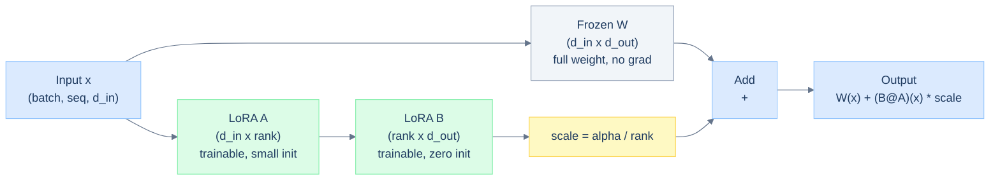
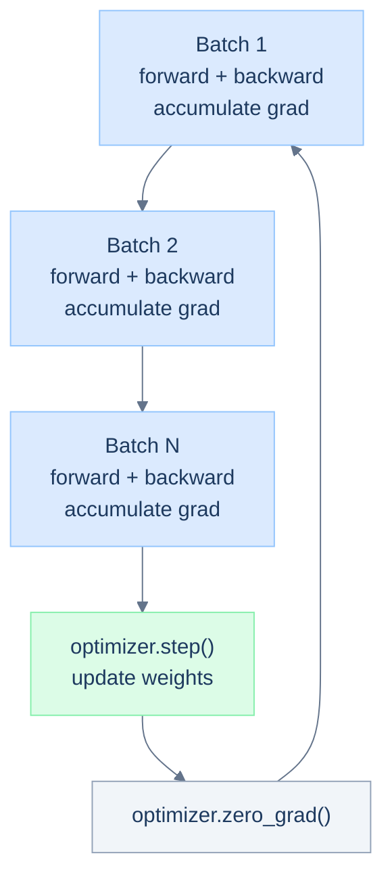

# Day 3: Fine-Tuning Ops

## Overview

Full fine-tuning updates all parameters of a pre-trained model, which for a 7B model means storing 28 GB of weights plus optimizer states. LoRA and QLoRA make fine-tuning practical on a single GPU by training only a tiny set of adapter weights. This session covers the mechanics of both techniques, walks through a training loop, demonstrates weight merging, and benchmarks the efficiency gains.

---

## Learning Objectives

- Understand LoRA's low-rank decomposition and why it works
- Implement a LoRA layer from scratch
- Run a training loop with gradient accumulation
- Merge LoRA adapter weights back into the base model
- Quantify the parameter efficiency gain versus full fine-tuning

---

## Prerequisites

From Days 1-2:
- Transformer architecture and decoder blocks
- How linear layers and weight matrices work
- Quantization concepts (INT8, NF4)

New tools used today:
- PEFT (HuggingFace parameter-efficient fine-tuning)
- bitsandbytes (NF4 quantization)
- HuggingFace Trainer

---

## Part 1: Why Not Full Fine-Tuning?

Full fine-tuning updates every parameter. For a 7B model:

| Resource | Full Fine-tuning | LoRA |
|---------|-----------------|------|
| Trainable params | 7B | ~4-8M |
| Optimizer states (Adam) | 56 GB | ~64 MB |
| Gradient storage | 28 GB | ~32 MB |
| Total VRAM needed | ~80 GB | ~6 GB |

LoRA's insight is that the **weight updates** learned during fine-tuning are low-rank. A full-rank weight delta `dW` of shape `(d, k)` can be approximated as `B @ A` where `B` is `(d, r)` and `A` is `(r, k)` and `r << min(d, k)`. In practice `r` is set to 8-64 and the approximation is tight for most tasks.

---

## Part 2: LoRA Mechanics

### Low-Rank Decomposition



At initialization:
- `A` is initialized with a small random normal (e.g. standard deviation 0.02)
- `B` is initialized to **zero**

This means `B @ A = 0` at the start, so the LoRA adapter contributes nothing at initialization and the base model behavior is preserved. The adapter learns only the residual update needed for the downstream task.

### LoRA Layer Implementation

```python
import torch
import torch.nn as nn

class LoRALinear(nn.Module):
    """Linear layer with a LoRA adapter. The base weight is frozen."""

    def __init__(self, in_features, out_features, rank=16, lora_alpha=32):
        super().__init__()
        self.in_features = in_features
        self.out_features = out_features
        self.rank = rank
        self.scaling = lora_alpha / rank

        # base weight - frozen
        self.weight = nn.Parameter(torch.randn(out_features, in_features))
        self.bias = nn.Parameter(torch.zeros(out_features))
        self.weight.requires_grad = False
        self.bias.requires_grad = False

        # LoRA matrices - trainable
        self.lora_A = nn.Parameter(torch.randn(rank, in_features) * 0.02)
        self.lora_B = nn.Parameter(torch.zeros(out_features, rank))

    def forward(self, x):
        base_out = nn.functional.linear(x, self.weight, self.bias)
        lora_out = (x @ self.lora_A.T @ self.lora_B.T) * self.scaling
        return base_out + lora_out

    def merge(self):
        """Fold LoRA update into the base weight. Call before deployment."""
        with torch.no_grad():
            self.weight.data += (self.lora_B @ self.lora_A) * self.scaling
        # after merge the adapter is redundant, disable it
        self.lora_A.requires_grad = False
        self.lora_B.requires_grad = False
```

### Parameter Efficiency

```python
in_dim, out_dim, rank = 768, 768, 16

full_params = in_dim * out_dim        # 589,824
lora_params = rank * in_dim + out_dim * rank  # 24,576

print(f"Full layer:  {full_params:,}")
print(f"LoRA layer:  {lora_params:,}")
print(f"Reduction:   {(1 - lora_params/full_params)*100:.1f}%")
# Reduction: 95.8%
```

---

## Part 3: QLoRA

QLoRA combines two techniques:

1. The **base model** is loaded in NF4 (4-bit) quantization - it is frozen and is never updated.
2. **LoRA adapters** sit on top in BF16 - they are trained normally.

The quantized base model handles the expensive forward/backward through frozen layers at low memory cost. The LoRA adapters, which are small, accumulate the actual task learning. Gradients are computed in BF16 even though the base weights are NF4.

```python
from transformers import AutoModelForCausalLM, BitsAndBytesConfig
from peft import get_peft_model, LoraConfig, TaskType

bnb_config = BitsAndBytesConfig(
    load_in_4bit=True,
    bnb_4bit_quant_type="nf4",
    bnb_4bit_compute_dtype=torch.bfloat16,
    bnb_4bit_use_double_quant=True,   # quantize the quantization constants too
)

model = AutoModelForCausalLM.from_pretrained(
    "meta-llama/Llama-2-7b-hf",
    quantization_config=bnb_config,
    device_map="auto",
)

lora_config = LoraConfig(
    task_type=TaskType.CAUSAL_LM,
    r=16,           # rank
    lora_alpha=32,  # scaling = alpha / r
    target_modules=["q_proj", "v_proj"],  # apply to query and value projections
    lora_dropout=0.05,
    bias="none",
)

model = get_peft_model(model, lora_config)
model.print_trainable_parameters()
# trainable params: 4,194,304 || all params: 6,742,609,920 || trainable: 0.06%
```

The `target_modules` list controls which linear layers get LoRA adapters. Applying to `q_proj` and `v_proj` is the standard choice; applying to all projection layers (`q_proj`, `k_proj`, `v_proj`, `o_proj`) uses more memory but gives better results.

---

## Part 4: Training Loop

### Gradient Accumulation

Gradient accumulation simulates a larger batch size by accumulating gradients over multiple forward passes before running the optimizer. This is important when batch size 1 is already at the GPU memory limit.



```python
import torch.optim as optim

optimizer = optim.AdamW(
    [p for p in model.parameters() if p.requires_grad],
    lr=2e-4,
    weight_decay=0.01
)

accumulation_steps = 4
optimizer.zero_grad()

for step, batch in enumerate(train_loader):
    input_ids = batch['input_ids'].to(device)
    labels = batch['labels'].to(device)

    outputs = model(input_ids, labels=labels)
    loss = outputs.loss / accumulation_steps
    loss.backward()

    if (step + 1) % accumulation_steps == 0:
        torch.nn.utils.clip_grad_norm_(model.parameters(), max_norm=1.0)
        optimizer.step()
        optimizer.zero_grad()
        print(f"Step {step+1}: loss = {loss.item() * accumulation_steps:.4f}")
```

Gradient clipping (max norm 1.0) prevents a bad batch from causing a large destabilizing update, which is especially important early in training.

### Training with the HuggingFace Trainer

For production fine-tuning, the Trainer handles checkpointing, evaluation, and logging:

```python
from transformers import TrainingArguments, Trainer

training_args = TrainingArguments(
    output_dir="./checkpoints",
    num_train_epochs=3,
    per_device_train_batch_size=4,
    gradient_accumulation_steps=4,
    learning_rate=2e-4,
    lr_scheduler_type="cosine",
    warmup_ratio=0.03,
    fp16=True,
    logging_steps=10,
    save_strategy="epoch",
    evaluation_strategy="epoch",
    report_to="none",
)

trainer = Trainer(
    model=model,
    args=training_args,
    train_dataset=train_dataset,
    eval_dataset=eval_dataset,
)

trainer.train()
```

---

## Part 5: Merging LoRA Weights

After training, you have two options for deployment:

1. **Keep adapter separate** - load the base model and the adapter at inference time. Slightly more overhead but easy to swap adapters.
2. **Merge adapter into base** - fold `B @ A * scaling` directly into the base weight. No inference overhead, cannot be unmerged.

```python
from peft import PeftModel

# load base (fp16) + adapter
base_model = AutoModelForCausalLM.from_pretrained("meta-llama/Llama-2-7b-hf", torch_dtype=torch.float16)
model = PeftModel.from_pretrained(base_model, "./checkpoints/final")

# merge and save as a standard HF model
merged = model.merge_and_unload()
merged.save_pretrained("./merged_model")
```

For our custom `LoRALinear`:

```python
def merge_all_lora(model):
    """Walk the model and call .merge() on every LoRALinear layer"""
    for module in model.modules():
        if isinstance(module, LoRALinear):
            module.merge()

merge_all_lora(model)

# Verify outputs match pre-merge
with torch.no_grad():
    before = model_before_merge(test_input)
    after = model_after_merge(test_input)
    print(f"Max output difference: {(before - after).abs().max():.2e}")
    # Should be < 1e-5
```

---

## Part 6: Benchmarking

```python
import time

def benchmark_inference(model, input_ids, num_runs=50):
    model.eval()
    if torch.cuda.is_available():
        torch.cuda.synchronize()

    start = time.perf_counter()
    with torch.no_grad():
        for _ in range(num_runs):
            _ = model(input_ids)

    if torch.cuda.is_available():
        torch.cuda.synchronize()

    elapsed = time.perf_counter() - start
    return elapsed / num_runs * 1000  # ms per forward pass

input_ids = torch.randint(0, 50000, (1, 128)).to(device)

ms_base = benchmark_inference(base_model, input_ids)
ms_lora = benchmark_inference(lora_model, input_ids)
ms_merged = benchmark_inference(merged_model, input_ids)

print(f"Base model:   {ms_base:.2f} ms")
print(f"LoRA model:   {ms_lora:.2f} ms  (+{(ms_lora/ms_base-1)*100:.1f}%)")
print(f"Merged model: {ms_merged:.2f} ms  ({(ms_merged/ms_base-1)*100:+.1f}%)")
```

The merged model has identical inference speed to the base model. The LoRA model has a tiny overhead (typically <2%) from the additional adapter computations.

---

## Key Takeaways

- LoRA works because fine-tuning weight updates are empirically low-rank - the full `dW` matrix can be approximated by `B @ A` with rank as low as 8.
- QLoRA extends this by freezing the base model at 4-bit NF4, reducing VRAM from 28 GB to ~6 GB for a 7B model.
- Zero initialization of `B` ensures the adapter starts as an identity transformation and only learns the task-specific delta.
- Gradient accumulation decouples effective batch size from GPU memory.
- Merging is a lossless operation - the merged model produces identical outputs and has no inference overhead.

---

## References

- [LoRA: Low-Rank Adaptation of Large Language Models](https://arxiv.org/abs/2106.09685) - Hu et al., 2021
- [QLoRA: Efficient Finetuning of Quantized LLMs](https://arxiv.org/abs/2305.14314) - Dettmers et al., 2023
- [HuggingFace PEFT Documentation](https://huggingface.co/docs/peft)
- [bitsandbytes](https://github.com/TimDettmers/bitsandbytes)
