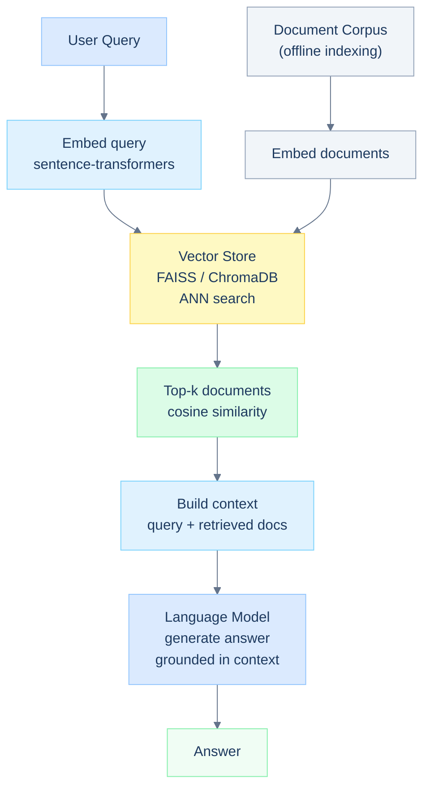
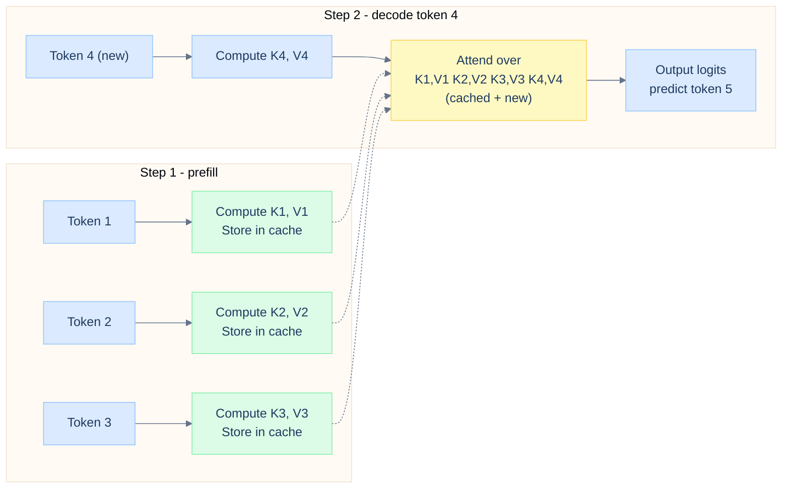
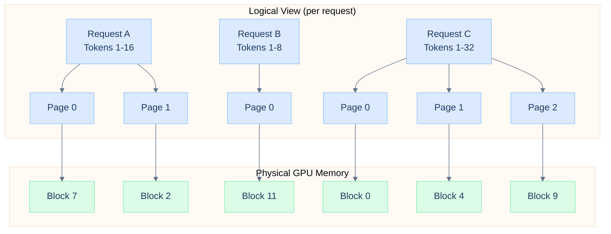

# Day 4: Retrieval + Inference

## Overview

This session splits into two halves. The first covers Retrieval-Augmented Generation (RAG) - how to give a language model access to external knowledge without re-training it. The second covers inference optimization - how to serve that model efficiently at scale using KV caching, PagedAttention, and continuous batching.

---

## Learning Objectives

- Build a RAG pipeline using semantic embeddings and a vector store
- Implement evaluation gates to measure retrieval quality
- Understand how the KV cache eliminates redundant computation
- Understand PagedAttention's memory management model
- Measure throughput gains from continuous batching

---

## Prerequisites

From Days 1-3:
- Attention mechanics and the KV decomposition
- Tokenization and embedding spaces
- Fine-tuned model from Day 3

New tools used today:
- sentence-transformers (bi-encoder embeddings)
- FAISS or ChromaDB (approximate nearest neighbor)
- vLLM (production inference server)

---

## Part 1: Retrieval-Augmented Generation

### Why RAG?

A language model's knowledge is frozen at its training cutoff. It cannot answer questions about events after that date, and it may hallucinate facts that were rare in training data. Fine-tuning is expensive and must be repeated whenever knowledge changes. RAG solves this by retrieving relevant documents at query time and injecting them into the model's context.



### Building the Index

```python
from sentence_transformers import SentenceTransformer
import faiss
import numpy as np

# load a bi-encoder for dense retrieval
embed_model = SentenceTransformer('BAAI/bge-base-en-v1.5')

# offline: embed and index your document corpus
documents = [
    "CUDA is a parallel computing platform developed by NVIDIA.",
    "Transformers use self-attention to model long-range dependencies.",
    "LoRA reduces trainable parameters by decomposing weight updates.",
    # ... thousands more
]

doc_embeddings = embed_model.encode(documents, normalize_embeddings=True)
# shape: (num_docs, 768)

# build a flat L2 FAISS index (cosine similarity after normalization)
index = faiss.IndexFlatIP(doc_embeddings.shape[1])
index.add(doc_embeddings.astype(np.float32))

print(f"Index contains {index.ntotal} vectors")
```

### Querying

```python
def retrieve(query, k=5):
    """Return top-k document indices and similarity scores"""
    q_emb = embed_model.encode([query], normalize_embeddings=True)
    scores, indices = index.search(q_emb.astype(np.float32), k)
    return indices[0], scores[0]

def rag_prompt(query, k=5):
    """Build the augmented prompt"""
    doc_ids, scores = retrieve(query, k)
    context = "\n\n".join(documents[i] for i in doc_ids)

    return f"""Answer the question based only on the context below.

Context:
{context}

Question: {query}
Answer:"""

query = "How does LoRA make fine-tuning memory efficient?"
prompt = rag_prompt(query)
```

---

## Part 2: Retrieval Evaluation

### Metrics

Before deploying a RAG system, you need to measure whether it retrieves the right documents. Two standard metrics:

**MRR (Mean Reciprocal Rank)** - given a ranked list, what is the reciprocal rank of the first relevant document? Averaged across queries.

```
Query: "How does attention work?"
Ranked results: [relevant, not relevant, not relevant, relevant, ...]
                   rank 1                                  rank 4
MRR contribution: 1/1 = 1.0
```

**nDCG (Normalized Discounted Cumulative Gain)** - measures ranking quality with graded relevance. Documents at lower ranks contribute less (discounted by log of rank).

```python
def ndcg_at_k(relevance_scores, k):
    """
    relevance_scores: list of relevance values (0 or 1) in ranked order
    Higher = retrieved document is more relevant
    """
    import numpy as np

    def dcg(scores, k):
        scores = np.array(scores[:k])
        if len(scores) == 0:
            return 0
        discounts = np.log2(np.arange(2, len(scores) + 2))
        return np.sum(scores / discounts)

    ideal = sorted(relevance_scores, reverse=True)
    idcg = dcg(ideal, k)
    if idcg == 0:
        return 0
    return dcg(relevance_scores, k) / idcg

# example: retrieved 5 docs, ranked, with ground truth relevance
retrieved_relevance = [1, 0, 1, 0, 1]   # 1 = relevant, 0 = not
print(f"nDCG@5 = {ndcg_at_k(retrieved_relevance, 5):.3f}")
```

### Hallucination Detection

A simple faithfulness check compares the generated answer against the retrieved context. More sophisticated approaches use an LLM-as-judge to verify each claim in the answer.

```python
def faithfulness_score(answer, context):
    """Fraction of answer tokens that appear in context"""
    answer_tokens = set(answer.lower().split())
    context_tokens = set(context.lower().split())
    overlap = answer_tokens & context_tokens
    return len(overlap) / (len(answer_tokens) + 1e-8)

score = faithfulness_score(
    answer="LoRA decomposes weight updates into low-rank matrices",
    context="LoRA reduces trainable parameters by decomposing weight updates into low-rank factors A and B."
)
print(f"Faithfulness: {score:.2f}")   # high = grounded in context
```

---

## Part 3: KV Cache

### The Problem

During autoregressive generation, the model generates one token at a time. For each new token, it runs attention over the entire sequence - including all previously generated tokens. Without caching, every decoding step re-computes the same K and V projections for every previous token, which is O(n) redundant work per step, or O(n^2) total for a sequence of length n.

### The Solution

The key insight: K and V for position `t` depend only on the input at position `t`, which does not change once computed. Cache them.



### Implementation

```python
class CachedAttention(nn.Module):

    def __init__(self, d_model, num_heads):
        super().__init__()
        self.num_heads = num_heads
        self.d_k = d_model // num_heads
        self.W_q = nn.Linear(d_model, d_model)
        self.W_k = nn.Linear(d_model, d_model)
        self.W_v = nn.Linear(d_model, d_model)
        self.W_o = nn.Linear(d_model, d_model)

    def forward(self, x, past_kv=None):
        B, T, C = x.shape

        Q = self.W_q(x).view(B, T, self.num_heads, self.d_k).transpose(1, 2)
        K = self.W_k(x).view(B, T, self.num_heads, self.d_k).transpose(1, 2)
        V = self.W_v(x).view(B, T, self.num_heads, self.d_k).transpose(1, 2)

        # append new K, V to cache
        if past_kv is not None:
            K = torch.cat([past_kv[0], K], dim=2)
            V = torch.cat([past_kv[1], V], dim=2)

        scores = torch.matmul(Q, K.transpose(-2, -1)) / math.sqrt(self.d_k)
        out = torch.matmul(torch.softmax(scores, dim=-1), V)
        out = out.transpose(1, 2).contiguous().view(B, T, -1)

        return self.W_o(out), (K, V)   # return updated cache

# generation loop
kv_caches = [None] * num_layers

for step in range(max_new_tokens):
    x = token_embeddings[:, -1:, :]   # only the newest token
    new_caches = []

    for layer, cache in zip(transformer_layers, kv_caches):
        x, new_cache = layer.attention(x, past_kv=cache)
        new_caches.append(new_cache)

    kv_caches = new_caches
    next_token = logits.argmax(dim=-1)
```

### Memory Cost

KV cache memory scales as: `2 * num_layers * num_heads * d_k * seq_len * bytes_per_element * batch_size`

For LLaMA-2-7B (32 layers, 32 heads, d_k=128, FP16):

```python
layers, heads, d_k, bytes = 32, 32, 128, 2

seq_len = 2048
per_token = 2 * layers * heads * d_k * bytes   # key + value
total_mb = per_token * seq_len / 1e6

print(f"Per token: {per_token} bytes")
print(f"2048-token sequence: {total_mb:.1f} MB")
# 2048-token sequence: 536.9 MB per batch element
```

---

## Part 4: PagedAttention

### The Problem with Static Allocation

Traditional serving allocates a contiguous block of GPU memory for the KV cache of each request, sized for the maximum possible sequence length. Since most requests are shorter than the maximum, most allocated memory is wasted. Worse, fragmentation means you cannot fit a new request even if total free memory would be sufficient.

### Virtual Paging

PagedAttention (the core innovation in vLLM) borrows the concept of virtual memory paging from operating systems. The KV cache for each request is stored in non-contiguous **pages** of fixed size. A page table maps logical sequence positions to physical GPU memory pages.



Benefits:
- No wasted pre-allocation
- Near-zero fragmentation
- Allows dynamic sequence growth
- Enables prefix caching (share K/V pages for identical prompt prefixes across requests)

---

## Part 5: Continuous Batching

### The Inefficiency of Static Batching

In static batching, you collect a batch of requests, run them to completion, then collect the next batch. Short requests finish early and their GPU resources sit idle until the entire batch is done. This leads to low GPU utilization when request lengths vary.

### Continuous (Iteration-Level) Batching

In continuous batching, the scheduler operates at the token-generation level. As soon as a request finishes, a new request from the queue takes its slot in the batch. The batch composition changes every iteration.

```mermaid
%%{init: {'theme': 'base', 'themeVariables': {'primaryColor': '#dbeafe', 'primaryTextColor': '#1e3a5f', 'primaryBorderColor': '#93c5fd', 'lineColor': '#64748b', 'secondaryColor': '#f1f5f9'}}}%%
gantt
    title Static vs Continuous Batching (GPU time)
    dateFormat X
    axisFormat %s

    section Static Batch
    Req A (50 tokens)  :a1, 0, 50
    Req B (20 tokens)  :a2, 0, 20
    Idle (waiting)     :crit, a3, 20, 50
    Req C starts only after batch    :a4, 50, 70

    section Continuous Batch
    Req A (50 tokens)  :b1, 0, 50
    Req B (20 tokens)  :b2, 0, 20
    Req C starts immediately :b3, 20, 60
```



```python
from vllm import LLM, SamplingParams

llm = LLM(
    model="meta-llama/Llama-2-7b-hf",
    tensor_parallel_size=1,
    gpu_memory_utilization=0.90,
)

sampling = SamplingParams(temperature=0.8, top_p=0.95, max_tokens=256)

prompts = [
    "Explain transformer attention in one paragraph:",
    "What is the difference between LoRA and QLoRA?",
    "Write a Python function to compute cosine similarity:",
]

outputs = llm.generate(prompts, sampling)

for output in outputs:
    print(f"Prompt: {output.prompt[:50]}...")
    print(f"Generated: {output.outputs[0].text[:100]}...")
    print()
```

vLLM handles continuous batching, PagedAttention, and KV cache management internally. You interact with it through a simple generate API.

---

## Part 6: Throughput Benchmark

```python
import time

def benchmark_throughput(llm, prompts, sampling_params):
    start = time.perf_counter()
    outputs = llm.generate(prompts, sampling_params)
    elapsed = time.perf_counter() - start

    total_tokens = sum(len(o.outputs[0].token_ids) for o in outputs)
    throughput = total_tokens / elapsed

    return {
        'elapsed_s': elapsed,
        'total_tokens': total_tokens,
        'throughput_tok_s': throughput,
        'latency_per_req_ms': elapsed / len(prompts) * 1000,
    }

# compare single request vs batched
single = benchmark_throughput(llm, prompts[:1], sampling)
batched = benchmark_throughput(llm, prompts * 10, sampling)

print(f"Single:  {single['throughput_tok_s']:.0f} tok/s")
print(f"Batched: {batched['throughput_tok_s']:.0f} tok/s")
print(f"Speedup: {batched['throughput_tok_s'] / single['throughput_tok_s']:.1f}x")
```

Typical results on an A100 80GB serving LLaMA-2-7B:

| Mode | Throughput | Latency |
|------|-----------|---------|
| Naive (no cache) | ~50 tok/s | 2000 ms |
| KV cache only | ~300 tok/s | 350 ms |
| KV cache + continuous batching | ~1500 tok/s | 150 ms |
| KV cache + PagedAttention + vLLM | ~2000+ tok/s | 100 ms |

---

## Key Takeaways

- RAG decouples knowledge from model parameters - update the document index without re-training.
- Evaluation metrics (nDCG, MRR, faithfulness) are essential before deploying a retrieval system in production.
- The KV cache converts O(n^2) attention recomputation during decoding into O(n) by storing previous K and V tensors.
- PagedAttention eliminates KV cache fragmentation and wasted pre-allocation, enabling higher batch sizes.
- Continuous batching keeps the GPU full by replacing completed requests immediately, improving throughput by 5-10x over static batching.

---

## References

- [Retrieval-Augmented Generation for Knowledge-Intensive NLP](https://arxiv.org/abs/2005.11401) - Lewis et al., 2020
- [Efficient Memory Management for LLM Serving with PagedAttention](https://arxiv.org/abs/2309.06180) - Kwon et al., 2023
- [vLLM Documentation](https://docs.vllm.ai/)
- [BAAI/bge Embeddings](https://huggingface.co/BAAI/bge-base-en-v1.5)
- [FAISS](https://github.com/facebookresearch/faiss)
