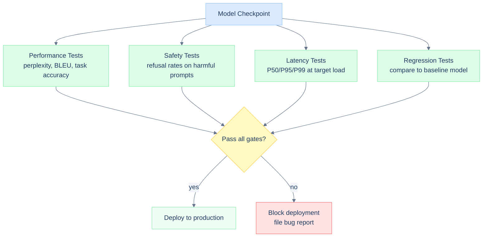

# Day 5: Deploy + Observability + Guardrails

## Overview

This session takes the fine-tuned model from Day 3 and operationalizes it: build a FastAPI service, instrument it with production-grade metrics, and add safety guardrails. The goal is a deployment-ready endpoint that a real user can interact with safely and that an operator can monitor.

---

## Learning Objectives

- Validate model quality before any deployment decision
- Build a FastAPI inference endpoint with async generation
- Log structured metrics (latency, throughput, cost, errors)
- Build an observability dashboard from raw log data
- Implement input and output guardrails for content safety
- Trace the full path from a user request to a monitored, guarded response

---

## Prerequisites

From Days 1-4:
- Trained or fine-tuned model checkpoint
- vLLM or HuggingFace generation pipeline
- KV cache and continuous batching concepts

New tools used today:
- FastAPI + uvicorn
- pydantic (request/response validation)
- prometheus_client or custom metrics logging

---

## Part 1: Pre-Deployment Validation

Before exposing a model to users, run a validation suite to catch regressions. This is especially important when deploying a fine-tuned model over a base model - you want to confirm the fine-tuning improved the target task without degrading general capabilities.



### Perplexity Gate

Perplexity measures how well the model predicts a held-out validation set. Lower is better. A fine-tuned model should have lower perplexity on the target domain than the base model.

```python
import torch
import torch.nn.functional as F
from transformers import AutoModelForCausalLM, AutoTokenizer

def compute_perplexity(model, tokenizer, texts, max_length=512):
    model.eval()
    total_nll = 0
    total_tokens = 0

    with torch.no_grad():
        for text in texts:
            inputs = tokenizer(text, return_tensors='pt', max_length=max_length, truncation=True)
            input_ids = inputs['input_ids'].to(model.device)

            outputs = model(input_ids, labels=input_ids)
            nll = outputs.loss.item()

            total_nll += nll * input_ids.shape[1]
            total_tokens += input_ids.shape[1]

    return torch.exp(torch.tensor(total_nll / total_tokens)).item()

val_texts = [
    "The transformer architecture uses self-attention to model dependencies.",
    "Quantization reduces memory footprint by lowering numerical precision.",
]

ppl = compute_perplexity(model, tokenizer, val_texts)
print(f"Validation perplexity: {ppl:.2f}")

PERPLEXITY_GATE = 50.0
assert ppl < PERPLEXITY_GATE, f"Perplexity {ppl:.2f} exceeds gate {PERPLEXITY_GATE}"
print("Perplexity gate: PASS")
```

### Latency Gate

Measure generation latency under the expected load before deployment:

```python
import time
import statistics

def measure_latency(model, tokenizer, prompt, num_tokens=100, num_runs=20):
    inputs = tokenizer(prompt, return_tensors='pt').to(model.device)
    latencies = []

    for _ in range(num_runs):
        start = time.perf_counter()
        with torch.no_grad():
            model.generate(
                inputs['input_ids'],
                max_new_tokens=num_tokens,
                do_sample=False,
            )
        latencies.append((time.perf_counter() - start) * 1000)

    return {
        'p50_ms': statistics.median(latencies),
        'p95_ms': sorted(latencies)[int(0.95 * len(latencies))],
        'p99_ms': sorted(latencies)[int(0.99 * len(latencies))],
    }

prompt = "Explain the difference between LoRA and full fine-tuning:"
stats = measure_latency(model, tokenizer, prompt)
print(f"P50: {stats['p50_ms']:.0f} ms")
print(f"P95: {stats['p95_ms']:.0f} ms")
print(f"P99: {stats['p99_ms']:.0f} ms")

assert stats['p95_ms'] < 5000, "P95 latency exceeds 5s SLA"
print("Latency gate: PASS")
```

---

## Part 2: FastAPI Inference Endpoint

### Architecture

```mermaid
%%{init: {'theme': 'base', 'themeVariables': {'primaryColor': '#dbeafe', 'primaryTextColor': '#1e3a5f', 'primaryBorderColor': '#93c5fd', 'lineColor': '#64748b', 'secondaryColor': '#f1f5f9'}}}%%
flowchart LR
    CLIENT["Client\nHTTP POST /generate"] --> GUARD_IN["Input Guardrail\ntoxicity, PII, length check"]
    GUARD_IN --> RATE["Rate Limiter\ntokens/sec per user"]
    RATE --> MODEL["Inference\nvLLM / HF Pipeline"]
    MODEL --> GUARD_OUT["Output Guardrail\nharmfulness check"]
    GUARD_OUT --> METRICS["Metrics Logger\nlatency, tokens, cost"]
    METRICS --> CLIENT

    style CLIENT fill:#f1f5f9,stroke:#94a3b8
    style GUARD_IN fill:#fef9c3,stroke:#fcd34d
    style RATE fill:#fef9c3,stroke:#fcd34d
    style MODEL fill:#dbeafe,stroke:#93c5fd
    style GUARD_OUT fill:#fef9c3,stroke:#fcd34d
    style METRICS fill:#dcfce7,stroke:#86efac
```



### Endpoint Implementation

```python
from fastapi import FastAPI, HTTPException
from pydantic import BaseModel, Field
from typing import Optional
import time
import uuid

app = FastAPI(title="LLM Inference API", version="1.0")

class GenerateRequest(BaseModel):
    prompt: str = Field(..., min_length=1, max_length=4096)
    max_tokens: int = Field(256, ge=1, le=2048)
    temperature: float = Field(0.7, ge=0.0, le=2.0)
    top_p: float = Field(0.95, ge=0.0, le=1.0)
    user_id: Optional[str] = None

class GenerateResponse(BaseModel):
    request_id: str
    text: str
    prompt_tokens: int
    completion_tokens: int
    latency_ms: float
    model_name: str

@app.post("/generate", response_model=GenerateResponse)
async def generate(request: GenerateRequest):
    request_id = str(uuid.uuid4())
    start_time = time.perf_counter()

    # input guardrail
    violation = check_input_safety(request.prompt)
    if violation:
        raise HTTPException(status_code=400, detail=f"Input rejected: {violation}")

    # rate limiter check
    if not rate_limiter.allow(request.user_id or "anonymous"):
        raise HTTPException(status_code=429, detail="Rate limit exceeded")

    # generate
    try:
        inputs = tokenizer(request.prompt, return_tensors='pt').to(device)
        prompt_tokens = inputs['input_ids'].shape[1]

        with torch.no_grad():
            output_ids = model.generate(
                inputs['input_ids'],
                max_new_tokens=request.max_tokens,
                temperature=request.temperature,
                top_p=request.top_p,
                do_sample=request.temperature > 0,
            )

        new_ids = output_ids[0, prompt_tokens:]
        generated_text = tokenizer.decode(new_ids, skip_special_tokens=True)
        completion_tokens = new_ids.shape[0]

    except Exception as e:
        metrics_logger.record_error(request_id, str(e))
        raise HTTPException(status_code=500, detail="Generation failed")

    # output guardrail
    output_violation = check_output_safety(generated_text)
    if output_violation:
        metrics_logger.record_filtered(request_id, output_violation)
        raise HTTPException(status_code=400, detail=f"Output filtered: {output_violation}")

    latency_ms = (time.perf_counter() - start_time) * 1000

    # log metrics
    metrics_logger.record(
        request_id=request_id,
        user_id=request.user_id,
        prompt_tokens=prompt_tokens,
        completion_tokens=completion_tokens,
        latency_ms=latency_ms,
    )

    return GenerateResponse(
        request_id=request_id,
        text=generated_text,
        prompt_tokens=prompt_tokens,
        completion_tokens=completion_tokens,
        latency_ms=latency_ms,
        model_name=MODEL_NAME,
    )

@app.get("/health")
async def health():
    return {"status": "ok", "model": MODEL_NAME}
```

---

## Part 3: Metrics Logging

### Structured Logger

Production metrics should be structured (JSON or time-series), queryable, and actionable. At minimum, log latency, token counts, and errors for every request.

```python
import json
import time
from collections import deque
from dataclasses import dataclass, asdict
from typing import Optional, List

@dataclass
class RequestRecord:
    request_id: str
    timestamp: float
    prompt_tokens: int
    completion_tokens: int
    latency_ms: float
    user_id: Optional[str] = None
    error: Optional[str] = None
    filtered: Optional[str] = None

class MetricsLogger:

    def __init__(self, window_size=1000):
        self.records: deque = deque(maxlen=window_size)
        self.cost_per_1k_tokens = 0.002   # adjust per model

    def record(self, request_id, prompt_tokens, completion_tokens, latency_ms, user_id=None):
        rec = RequestRecord(
            request_id=request_id,
            timestamp=time.time(),
            prompt_tokens=prompt_tokens,
            completion_tokens=completion_tokens,
            latency_ms=latency_ms,
            user_id=user_id,
        )
        self.records.append(rec)
        print(json.dumps(asdict(rec)))   # structured log line

    def record_error(self, request_id, error):
        rec = RequestRecord(
            request_id=request_id,
            timestamp=time.time(),
            prompt_tokens=0,
            completion_tokens=0,
            latency_ms=0,
            error=error,
        )
        self.records.append(rec)

    def record_filtered(self, request_id, reason):
        rec = RequestRecord(
            request_id=request_id,
            timestamp=time.time(),
            prompt_tokens=0,
            completion_tokens=0,
            latency_ms=0,
            filtered=reason,
        )
        self.records.append(rec)

    def summary(self) -> dict:
        completed = [r for r in self.records if r.error is None and r.filtered is None and r.latency_ms > 0]
        if not completed:
            return {"message": "no completed requests"}

        latencies = sorted(r.latency_ms for r in completed)
        total_tokens = sum(r.prompt_tokens + r.completion_tokens for r in completed)
        errors = sum(1 for r in self.records if r.error is not None)
        filtered = sum(1 for r in self.records if r.filtered is not None)
        total = len(self.records)

        return {
            "total_requests": total,
            "completed": len(completed),
            "errors": errors,
            "filtered": filtered,
            "error_rate": errors / total if total else 0,
            "filter_rate": filtered / total if total else 0,
            "latency_p50_ms": latencies[len(latencies) // 2],
            "latency_p95_ms": latencies[int(0.95 * len(latencies))],
            "latency_p99_ms": latencies[int(0.99 * len(latencies))],
            "total_tokens": total_tokens,
            "estimated_cost_usd": total_tokens / 1000 * self.cost_per_1k_tokens,
        }

metrics_logger = MetricsLogger()
```

### Cost Tracking

Cost tracking requires knowing the price per token for your deployment:

```python
COST_TABLE = {
    "llama-2-7b":   {"input": 0.0002, "output": 0.0002},  # $ per 1k tokens
    "llama-2-13b":  {"input": 0.0003, "output": 0.0003},
    "gpt-3.5-turbo": {"input": 0.0015, "output": 0.002},
}

def estimate_cost(model_name, prompt_tokens, completion_tokens):
    rates = COST_TABLE.get(model_name, {"input": 0.001, "output": 0.001})
    input_cost = (prompt_tokens / 1000) * rates["input"]
    output_cost = (completion_tokens / 1000) * rates["output"]
    return input_cost + output_cost
```

---

## Part 4: Observability Dashboard

Print a human-readable snapshot of the running service at any point:

```python
import statistics

def render_dashboard(logger: MetricsLogger):
    stats = logger.summary()
    records = list(logger.records)

    completed = [r for r in records if r.latency_ms > 0 and not r.error and not r.filtered]
    latencies = [r.latency_ms for r in completed]

    print("=" * 60)
    print("  LLM Inference Dashboard")
    print("=" * 60)

    print(f"\nRequest Volume:")
    print(f"  Total:      {stats.get('total_requests', 0)}")
    print(f"  Completed:  {stats.get('completed', 0)}")
    print(f"  Errors:     {stats.get('errors', 0)}  ({stats.get('error_rate', 0)*100:.1f}%)")
    print(f"  Filtered:   {stats.get('filtered', 0)}  ({stats.get('filter_rate', 0)*100:.1f}%)")

    if latencies:
        print(f"\nLatency (ms):")
        print(f"  P50: {stats.get('latency_p50_ms', 0):.0f}")
        print(f"  P95: {stats.get('latency_p95_ms', 0):.0f}")
        print(f"  P99: {stats.get('latency_p99_ms', 0):.0f}")

        # throughput
        time_span = max(r.timestamp for r in completed) - min(r.timestamp for r in completed)
        if time_span > 0:
            rps = len(completed) / time_span
            tok_per_sec = stats.get('total_tokens', 0) / time_span
            print(f"\nThroughput:")
            print(f"  Requests/s: {rps:.2f}")
            print(f"  Tokens/s:   {tok_per_sec:.0f}")

    print(f"\nCost:")
    print(f"  Total tokens: {stats.get('total_tokens', 0):,}")
    print(f"  Est. cost:    ${stats.get('estimated_cost_usd', 0):.4f}")
    print("=" * 60)
```

---

## Part 5: Safety Guardrails

Guardrails operate at two points: on the user's input before it reaches the model, and on the model's output before it reaches the user.

```mermaid
%%{init: {'theme': 'base', 'themeVariables': {'primaryColor': '#dbeafe', 'primaryTextColor': '#1e3a5f', 'primaryBorderColor': '#93c5fd', 'lineColor': '#64748b', 'secondaryColor': '#f1f5f9'}}}%%
flowchart LR
    INPUT["User Input"] --> LEN["Length check\nmax tokens"]
    LEN --> TOX_IN["Toxicity classifier\nblock harmful content"]
    TOX_IN --> PII["PII detector\nredact or reject"]
    PII --> MODEL["Model"]
    MODEL --> TOX_OUT["Toxicity classifier\noutput filter"]
    TOX_OUT --> HALL["Hallucination score\noptional"]
    HALL --> OUTPUT["User Output"]

    style INPUT fill:#f1f5f9,stroke:#94a3b8
    style LEN fill:#fef9c3,stroke:#fcd34d
    style TOX_IN fill:#fef9c3,stroke:#fcd34d
    style PII fill:#fef9c3,stroke:#fcd34d
    style MODEL fill:#dbeafe,stroke:#93c5fd
    style TOX_OUT fill:#fef9c3,stroke:#fcd34d
    style HALL fill:#fef9c3,stroke:#fcd34d
    style OUTPUT fill:#f1f5f9,stroke:#94a3b8
```



### Input Guardrail

```python
import re

HARMFUL_PATTERNS = [
    r'\b(how to make|instructions for|steps to)\b.{0,30}\b(bomb|weapon|malware|exploit)\b',
    r'\b(generate|write|create)\b.{0,30}\b(malware|ransomware|phishing)\b',
]

PII_PATTERNS = {
    'ssn':   r'\b\d{3}-\d{2}-\d{4}\b',
    'email': r'\b[a-zA-Z0-9._%+-]+@[a-zA-Z0-9.-]+\.[a-Z]{2,}\b',
    'phone': r'\b\d{3}[-.]?\d{3}[-.]?\d{4}\b',
}

def check_input_safety(text: str) -> Optional[str]:
    """Returns a violation description, or None if input is safe."""
    # length check
    if len(text.split()) > 1024:
        return "input_too_long"

    text_lower = text.lower()

    # harmful content
    for pattern in HARMFUL_PATTERNS:
        if re.search(pattern, text_lower):
            return "harmful_content"

    # PII detection
    for name, pattern in PII_PATTERNS.items():
        if re.search(pattern, text):
            return f"pii_{name}"

    return None

def redact_pii(text: str) -> str:
    """Replace PII tokens with placeholders"""
    replacements = {
        'ssn':   (PII_PATTERNS['ssn'],   '[SSN]'),
        'email': (PII_PATTERNS['email'], '[EMAIL]'),
        'phone': (PII_PATTERNS['phone'], '[PHONE]'),
    }
    result = text
    for _, (pattern, placeholder) in replacements.items():
        result = re.sub(pattern, placeholder, result)
    return result
```

### Output Guardrail

```python
UNSAFE_OUTPUT_PATTERNS = [
    r'\b(step 1|first,|to begin)\b.{0,100}\b(synthesize|manufacture|create)\b.{0,50}\b(explosive|poison|drug)\b',
]

def check_output_safety(text: str) -> Optional[str]:
    """Returns a violation reason, or None if output is safe."""
    text_lower = text.lower()
    for pattern in UNSAFE_OUTPUT_PATTERNS:
        if re.search(pattern, text_lower):
            return "unsafe_output"
    return None

def hallucination_score(prompt: str, response: str) -> float:
    """Simple lexical overlap as a proxy for groundedness."""
    prompt_tokens = set(prompt.lower().split())
    response_tokens = set(response.lower().split())
    overlap = prompt_tokens & response_tokens
    return len(overlap) / (len(response_tokens) + 1e-8)
```

### Rate Limiter

```python
from collections import defaultdict

class TokenBucketRateLimiter:
    """Token bucket rate limiter - allows short bursts up to bucket capacity."""

    def __init__(self, rate=10, capacity=20):
        self.rate = rate           # tokens added per second
        self.capacity = capacity   # max bucket size
        self.buckets: dict = defaultdict(lambda: capacity)
        self.last_refill: dict = defaultdict(time.time)

    def allow(self, user_id: str) -> bool:
        now = time.time()
        elapsed = now - self.last_refill[user_id]
        self.buckets[user_id] = min(
            self.capacity,
            self.buckets[user_id] + elapsed * self.rate
        )
        self.last_refill[user_id] = now

        if self.buckets[user_id] >= 1:
            self.buckets[user_id] -= 1
            return True
        return False

rate_limiter = TokenBucketRateLimiter(rate=5, capacity=10)
```

---

## Part 6: Deployment Checklist

Before any production launch, verify each of the following:

```python
checklist = [
    # Validation
    ("Perplexity gate passed",            None),
    ("Latency P95 under SLA",             None),
    ("Safety test suite passing (>95%)",  None),
    ("Regression tests not degraded",     None),

    # Infrastructure
    ("Health endpoint returning 200",     None),
    ("Metrics logging writing to sink",   None),
    ("Rate limiting configured",          None),
    ("Input guardrail active",            None),
    ("Output guardrail active",           None),

    # Observability
    ("Latency percentiles being recorded", None),
    ("Error rate alert configured",        None),
    ("Cost tracking active",               None),

    # Operations
    ("Model checkpoint versioned",        None),
    ("Rollback procedure documented",     None),
    ("On-call runbook written",           None),
]

results = {}
for item, check_fn in checklist:
    if check_fn is not None:
        passed = check_fn()
        results[item] = "PASS" if passed else "FAIL"
    else:
        results[item] = "MANUAL"

print("\nDeployment Checklist")
print("-" * 50)
for item, status in results.items():
    marker = "+" if status in ("PASS", "MANUAL") else "x"
    print(f"  [{marker}] {item}: {status}")

fails = [k for k, v in results.items() if v == "FAIL"]
if fails:
    print(f"\nBLOCKED: {len(fails)} items failed")
else:
    print("\nAll checks passed - deployment cleared")
```

---

## Key Takeaways

- Validation gates (perplexity, latency, safety) prevent shipping a broken or regressed model.
- FastAPI + pydantic gives you a typed, self-documenting API with minimal boilerplate.
- Structured logging makes metrics queryable - raw print statements do not.
- Latency percentiles (P50/P95/P99) reveal tail behavior that averages hide; always monitor P99 for SLA decisions.
- Guardrails at input and output are defense-in-depth - neither alone is sufficient.
- Rate limiting at the token bucket level handles burst traffic without blocking legitimate users.

---

## References

- [FastAPI Documentation](https://fastapi.tiangolo.com/)
- [Prometheus Python Client](https://github.com/prometheus/client_python)
- [LLM Observability Best Practices](https://docs.arize.com/arize/llm-large-language-models/llm-tracing)
- [Llama Guard](https://ai.meta.com/research/publications/llama-guard-llm-based-input-output-safeguard-for-human-ai-conversations/) - Meta's content safety model
- [OWASP Top 10 for LLMs](https://owasp.org/www-project-top-10-for-large-language-model-applications/)
